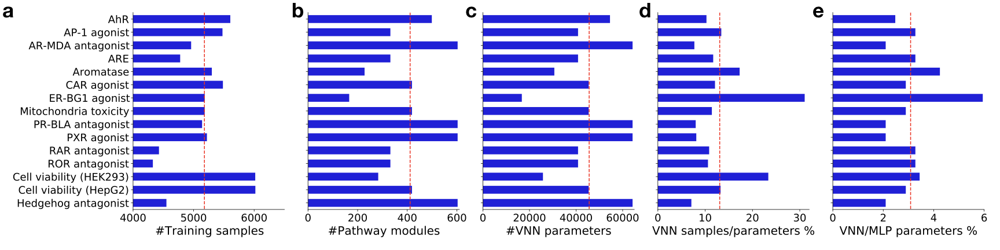

# The aim of this repository is to develop a knowledge-guided deep learning model to improve the interpretability of toxicity prediction. 

## Introduction 
 
Visible neural network (VNN) is a type of neural network whose structure is guided by extensive knowledge from biological ontologies and pathways. The incorporation of ontological hierarchy in VNN forms a meaningful network structure that connects input gene features to output response via hidden pathway modules, making the model highly interpretable at both gene and pathway level. Previous studies have demonstrated the excellent performance of VNN in a few tasks, such as predicting growth rate of yeast cells from gene deletion genotypes, predicting drug response and synergy in cancer cell lines, modeling cancer dependencies, and stratifying prostate cancer patients by treatment-resistance state. In this study, we employed the Reactome pathway hierarchy to develop a VNN model, namely DTox, for predicting compound response to 15 toxicity assays. Further, we developed a DTox interpretation framework for identifying VNN paths that can explain the toxicity outcome of compounds. We connected the identified VNN paths to cellular mechanisms of toxicity by showing their involvement in the target pathway of respective assay, their differential expression in the matched LINCS experiment, and their compliance with screening results from mechanism of action assays. We applied the DTox models of cell viability to perform a virtual screening of ~700,000 compounds and linked the predicted cytotoxicity score with clinical phenotypes of drug-induced liver injury. In general, DTox interpretation framework will benefit in silico mechanistic study and generate testable hypotheses for further investigation.

## Method

We designed a VNN structure (shown in the figure above) that connects target proteins (input features) to assay outcome (output response) via Reactome pathways (hidden modules). The feature profile containing 361 target proteins was inferred from structural properties of a compound using our previously developed method, TargetTox. By our design, each pathway is represented by 1-20 neurons depending on its size. Connections between input features and the first hidden layer are constrained to follow protein-pathway annotations while the connections among hidden layers are constrained to follow child-parent pathway relations. The incorporation of pathway hierarchy makes DTox VNN model highly interpretable, in contrast to conventional black-box neural network models. For more details about the VNN model, please refer to our manuscript. 

## Results

We trained DTox VNN models on 15 datasets from the Tox21 high throughput screening program. Each dataset contains active and inactive compounds of one toxicity assay, with an average of 5,178 available compounds per assay (part a of figure above). We implemented an early stopping criterion to speed up the training process. As a result, the training process was completed within 100-200 epochs for all 15 datasets (see [here](plot/compound_target_probability_tox21_implementation/training_loss/) for details). We also implemented hyperparameter tuning by grid search to derive an optimal model for the prediction of each assay outcome. On average, an optimal DTox VNN model contains 412 hidden pathway modules (part b of figure above), and 45,623 neural network parameters (part c of figure above). The average ratio between number of training samples versus number of network parameters is 0.13±0.03 (part d of figure above), with the model of estrogen receptor agonist assay being the highest (0.31) and the model of hedgehog antagonist assay being the lowest (0.07). Compared to a conventional multi-layer perceptron (MLP) model, DTox VNN model has far fewer network parameters. On average, the number of network parameters for a DTox VNN only accounts for three percent of the number for a matched MLP (part e of figure above).

To customize the network structure for prediction of each assay outcome, we made the root biological process a hyperparameter of DTox VNN. This means through hyperparameter tuning, we can choose a branch or combination of branches from the Reactome pathway hierarchy that result in the best predictive performance for an assay of interest. For instance, signal transduction pathways alone can deliver the optimal model for HEK293 cell viability assay (figure above). By contrast, pathways from all candidate biological processes are included in the optimal model of androgen receptor antagonist assay, as is the case for progesterone receptor antagonist assay, pregnane X receptor agonist assay, and hedgehog antagonist assay. In general, models built with multiple branches perform better than models built with a single branch.

We validated the predictive performance of DTox VNN models on held-out validation sets, which by average contain 1,295 compounds per assay. Note that the validation sets are not involved in any part of the training process. The optimal models of all 15 assays exhibit an area under the ROC curve (AUROC) above 0.7 (0.7-0.8: 6 models, 0.8-0.9: 9 models). Similarly, 14 models exhibit a balanced accuracy above 0.55 (0.55-0.65: 9 models, 0.65-0.75: 4 models, > 0.75: 1 model) except for the optimal model of AP-1 signaling agonist assay. We then compared the optimal performance of DTox VNN against four other classification algorithms: (i) an alternative model built with shuffled pathway hierarchy (VNN-S), (ii) a matched MLP model, (iii) an optimal random forest model (RF), and (iv) an optimal gradient boosting model (GB). In general, DTox VNN model achieved the same level of predictive performance as these well-established classification algorithms. (see [here](plot/compound_target_probability_tox21_implementation/method_comparison/)).

The codes to implement our pipeline can be found in [`src/`](src/), along with detailed documentation.

Detailed documentation about our results and figures can be found at [`data/`](data/) and [`plot/`](plot/), respectively.

## References

+ Richard, A. M. et al. The Tox21 10K Compound Library: Collaborative Chemistry Advancing Toxicology. Chem Res Toxicol 34, 189-216, doi:10.1021/acs.chemrestox.0c00264 (2021).

+ Ma, J. et al. Using deep learning to model the hierarchical structure and function of a cell. Nature methods 15, 290-298, doi:10.1038/nmeth.4627 (2018).

+ Kuenzi, B. M. et al. Predicting Drug Response and Synergy Using a Deep Learning Model of Human Cancer Cells. Cancer cell 38, 672-684 e676, doi:10.1016/j.ccell.2020.09.014 (2020).

+ Lin, C. H. & Lichtarge, O. Using Interpretable Deep Learning to Model Cancer Dependencies. Bioinformatics, doi:10.1093/bioinformatics/btab137 (2021).

+ Elmarakeby, H. A. et al. Biologically informed deep neural network for prostate cancer discovery. Nature 598, 348-352, doi:10.1038/s41586-021-03922-4 (2021).

+ Hao, Y. & Moore, J. H. TargetTox: A Feature Selection Pipeline for Identifying Predictive Targets Associated with Drug Toxicity. J Chem Inf Model 61, 5386-5394, doi:10.1021/acs.jcim.1c00733 (2021).

+ Jassal, B. et al. The reactome pathway knowledgebase. Nucleic acids research 48, D498- D503, doi:10.1093/nar/gkz1031 (2020).

+ Bach, S. et al. On Pixel-Wise Explanations for Non-Linear Classifier Decisions by Layer-Wise Relevance Propagation. PloS one 10, e0130140, doi:10.1371/journal.pone.0130140 (2015).

